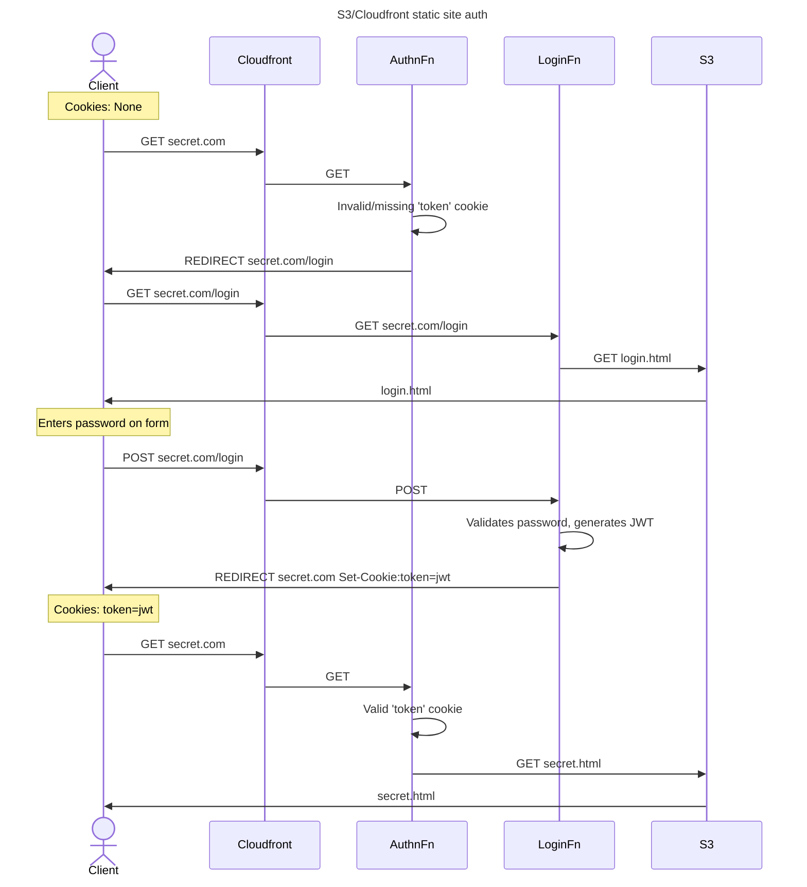



One disadvantage of static sites is that since all dynamic behavior like login/authentication must
be client-side, it's usually not easy to host any private content on them without building a
backend.

There are workarounds for this, such as putting the site behind an authentication layer using HTTP
Basic Auth. [[^1]] There are many existing
[tutorials](https://medium.com/hackernoon/serverless-password-protecting-a-static-website-in-an-aws-s3-bucket-bfaaa01b8666)
for implementing this, but the general idea is to only grant access to the underlying static
resource (S3 bucket, in the AWS space) to a Cloudfront CDN distribution. The CDN invokes a
serverless function on each view request, which checks for the Authentication header before allowing
the request to retrieve the resource.

HTTP Basic Auth is simple and effective for the purpose, but also has its limitations:

- Frustratingly, it doesn't always play nice with password managers. If you want to use a secure,
  long password or rotate passwords, this is an issue.
- You don't have control over how long the credentials are cached. Your browser will cache the
  credentials so you don't have to keep re-entering the creds, but it will decide on its own when
  that cache expires.
- It's
  [challenging](https://stackoverflow.com/questions/233507/how-to-log-out-user-from-web-site-using-basic-authentication)
  to implement logout that works across browsers. (In fact, I never ended up getting it to work.)

I wanted solve these by creating the full login page experience to access to my static site, but
retain the cost and simplicity of deploying the site just to an S3 bucket.

## Authenticating access to S3 with HTTP Basic Auth

In [Basic Auth](https://developer.mozilla.org/en-US/docs/Web/HTTP/Authentication), the client sends
an HTTP `Authentication` header with a username/password in plaintext (use SSL!) which the
backend/auth service can validate. If the header is not present or has incorrect creds, the backend
responds with a 401 and challenge that the browser interprets to show an old-school "login" dialogue
box.


To summarize the existing technique of using Basic Auth for S3 static sites, the "server" in this
case is a Lambda@Edge function:

1. The static site is stored in an S3 bucket, with access granted only to a Cloudfront (CDN)
   distribution.
2. The Cloudfront distribution invokes a Lambda@Edge function on each viewer request. This function
   decides what the response will be to the Cloudfront request (i.e., whether to reject with 401 or
   to forward the request to the S3 origin).
3. The Lambda function itself will simply look for the correct authentication header on the request.

Lambda@Edge is a Cloudfront concept where Cloudfront replicates a given Lambda function in multiple
AWS regions, and invokes the closest one to the client on configurable triggers -- in this case, we
trigger the function to run on any viewer request of the resource, our S3 bucket, and it checks the
auth header.

I hadn't used CDN services before this, but it makes sense that this is possible; CDNs serving
cached contents like photos/videos would also need to have auth to verify the viewer's authorization
to view the payload -- e.g. Instagram pictures only being available to your followers.

## Implementing a login page for a static site

Now, we want to adapt the technique of using Cloudfront and Lambda functions to instead authenticate
on a separate login page. The ultimate goal here is to have something that will work with password
managers, but the outcome will also more closely align with how modern websites implement auth, so
we also get better control of the caching and invalidation of credentials too.

In modern websites, the user submits their credentials (username/password) to the form on the
website's login page. The site's backend verifies the credentials against its database, and returns
an _Access Token_ if correct. The token is encrypted with a private key stored in the website's
backend; the most popular form of this is [JSON web tokens](https://jwt.io).

### Login page and POST handler

To apply this to our static site, first we need a simple page with our login form. Voila,
`login.html`, to be stored alongside our private resources in S3:

```html
<body>
  <form method="post">
    <label>Username: </label>
    <input type="text" name="username" required /><br />
    <label>Password: </label>
    <input type="password" name="password" required /><br />
    <button type="submit">Login</button>
  </form>
</body>
```

We need to be able to serve this page when the client requests it, but check the credentials in the
form when the client `POST`s to it. Typically you'd just have a server backend which returns the
HTML on `GET` to that route and processes the form on a `POST` to it. But in our serverless setup we
can approximate that with a Lambda@Edge function which triggers on a viewer request to the `/login`
route on Cloudfront:

```js
exports.handler = (event, _context, callback) => {
  const request = event.Records[0].cf.request;
  const host = request.headers.host[0].value;

  switch (request.method) {
    case "GET":
      // Simply let the request through to the origin (i.e. S3 bucket).
      callback(null, request);
      break;
    case "POST":
      // TODO: check the username/password here!
      break;
    default:
      // Any other HTTP methods redirect back to login page
      callback(null, getRedirectResponse(host, "login.html"));
      break;
  }
};
```

Passwords are typically stored hashed server-side/in the database. This example, by way of
demonstration, stores a single username/password in an environment variable on the Lambda function:

```js
function validCredentials(formParams) {
  // Ensure that the form has `username` and `password` keys
  if (!formParams.username || !formParams.password) {
    return false;
  }

  // The username and password to be compared against
  const user = process.env.USERNAME;
  const hash = process.env.PASSWORD_HASH;

  // Hash the submitted password and compare against the expected creds.
  const pwHash = crypto.createHash("sha256").update(formParams.password).digest("hex");
  if (formParams.username != user || pwHash != hash) {
    return false;
  }

  return true;
}
```

Back in the handler body, extract the form parameters from the body and call the function to check
it:

```js
// In CloudFront, the request body is base64-encoded in the `request` object
const body = Buffer.from(request.body.data, "base64").toString();
const params = querystring.parse(body);

if (validCredentials(params)) {
  // TODO: return a successful login response
} else {
  // Incorrect creds: redirect back to login page
  callback(null, getRedirectResponse(host, "public/login.html"));
}
```

On successful credentials, we generate an JWT access token and attach it to the response in a
`Set-Cookie` header:

```js
// Sign a JSON web token with a secret key (also stored in the function's environment variable)
// The `id` here is arbitrary, since there's only one possible user in this demonstration.
const token = jwt.sign({ id: 314 }, process.env.SECRET_KEY, {
  expiresIn: "1h",
});
// Create a response to redirect back to the root of the domain (our secret page), attaching the
// access token to the response as a cookie.
const response = getRedirectResponse(host, "");
response.headers["set-cookie"] = [
  {
    key: "Set-Cookie",
    value: `token=${tokenVal}; HttpOnly; Path=/; SameSite=Strict; Max-Age=86400`,
  },
];
```

In the `Set-Cookie` header, the attributes are necessary or important for modern web security:

- `HttpOnly`: instructs the browser to not expose the cookie to Javascript running client-side. This
  prevents leaking an access token to
  [cross-site scripting](https://en.wikipedia.org/wiki/Cross-site_scripting) attacks.
- `Path=/`: since our `/login` URL is different than the root of the site, this is necessary for the
  browser to send the cookie on requests to other pages on the domain.
- `SameSite=Strict`: the cookie is not sent on cross-site requests -- i.e., requests to your site's
  domain when the client is on a different site. This helps prevent
  [CSRF](https://en.wikipedia.org/wiki/Cross-site_request_forgery) attacks. Since this is a static
  site where it'd be unusual for HTTP requests to have side effects, this probably won't matter
  much, but it's a security best-practice for the general case.
- `Max-Age`: sets an expiry in the client, after which the cookie is cleared. Since the token expiry
  in the JWT payload is shorter than the one we set on the cookie header, the exact number here does
  not matter, but setting it prevents the default behavior of the browser clearing the cookie when
  the session is over.

### Protected resource handler

Now when the client authenticates, it gets a cookie containing the signed JWT access token, and is
redirected to the domain root -- the page we want to require authentication to access. So, accessing
the domain root must itself check for a valid token in the cookies to allow access.

So we create a function invoked by Cloudfront for the default (root) route to validate the access
token:

```js
exports.handler = (event, _context, callback) => {
  // Get the request and its headers
  const request = event.Records[0].cf.request;
  const headers = request.headers;
  const host = headers.host[0].value;

  if (!headers.cookie) {
    // No cookie -> authentication failed.
    redirectToLogin(host, callback);
    return;
  }

  // Find the 'token' cookie in headers and verify it with JWT
  for (let i = 0; i < headers.cookie.length; i++) {
    const cookie = querystring.parse(headers.cookie[i].value);
    if (cookie.token) {
      try {
        const data = jwt.verify(cookie.token, process.env.SECRET_KEY);
        // User has authenticated, let the request pass through.
        callback(null, request);
      } catch {
        // JWT throws on a token not signed by our key.
        // Fall through to redirect
      }
    }
  }

  redirectToLogin(host, callback);
};
```

On auth failures, we simply return a redirect response to the login page:

```js
function redirectToLogin(host, callback) {
  const response = {
    status: "302",
    statusDescription: "Found",
    headers: {
      location: [
        {
          key: "Location",
          value: `https://${host}/public/login.html`,
        },
      ],
    },
  };
  callback(null, response);
}
```

That's it! The whole flow for authentication looks like this:



The complete code for the Lambda handlers can be found on Github:
[aymarino/static-site-login](https://github.com/aymarino/static-site-login).

<hr/>

[^1]:
    Since I first started doing this, another [tool](https://github.com/robinmoisson/staticrypt) has
    come up to serve the full site content encrypted, and prompt client-side for a decryption key.
    This one is interesting. I'd probably choose this method in the future just for its simplicity,
    and may even move to it as it allows for hosting the site on GitHub Pages rather than needing a
    full cloud provider.

    It does limit you in some regards, as you don't control the authentication logic. For example,
    it would not be easy to allow for multiple users with different passwords, or detect failed
    login attempts. You also end up serving the entire (encrypted) webpage to
    potentially-unauthorized users. This could be an issue if the content is large, as you typically
    pay for that bandwidth. For 'Remember Me' functionality, the credential must be stored in local
    storage which is vulnerable to malicious client-side scripts.
